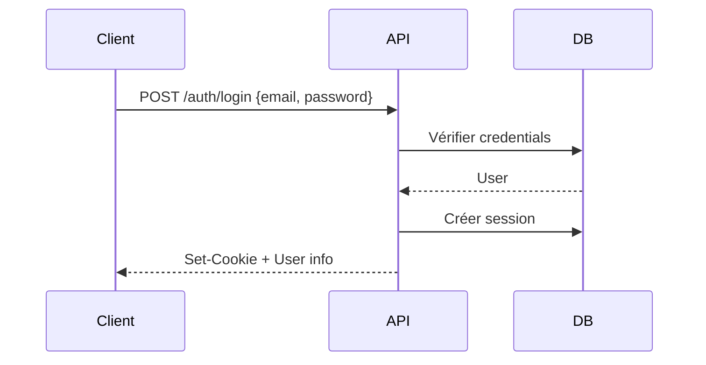
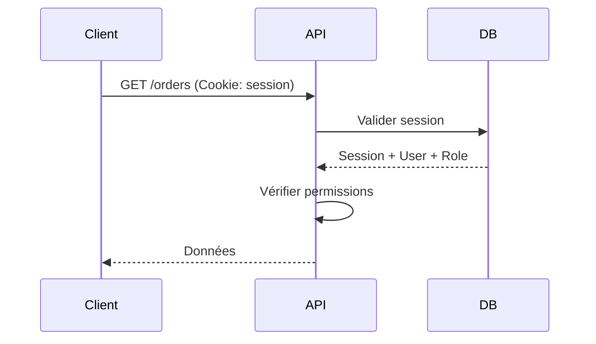

# Authentification

Échoppe utilise un système d'authentification par sessions.

## Sessions

### Stockage
Les sessions sont stockées en base de données :
- `user_session` pour les administrateurs
- `customer_session` pour les clients

### Cookies

| Cookie | Usage | Options |
|--------|-------|---------|
| `echoppe_admin_session` | Session admin | HTTP-only, Secure, SameSite=Strict |
| `echoppe_customer_session` | Session client | HTTP-only, Secure, SameSite=Strict |

### Durée
- Durée par défaut : 7 jours
- Refresh automatique à chaque requête

## Plugin d'authentification

Le plugin `authPlugin` gère l'authentification dans l'API.

### Usage

```typescript
import { Elysia } from 'elysia';
import { authPlugin } from './plugins/auth';

const app = new Elysia()
  .use(authPlugin)
  .get('/public', () => 'Public') // Pas d'auth
  .get('/private', ({ currentUser }) => currentUser, { auth: true }); // Auth requise
```

### Macro `auth`

```typescript
// Route publique (défaut)
.get('/products', handler)

// Route protégée - authentification requise
.get('/orders', handler, { auth: true })

// Route protégée avec permission spécifique
.post('/products', handler, { auth: true, permission: 'products.create' })
```

### Context injecté

Quand `auth: true`, le contexte contient :
- `currentUser` : utilisateur connecté
- `currentRole` : rôle de l'utilisateur
- `currentSession` : session active

## RBAC (Role-Based Access Control)

### Structure

```
Role ──── RolePermission ──── Permission
  │
  └── User
```

### Permissions

Format : `resource.action`

Exemples :
- `products.read`
- `products.create`
- `products.update`
- `products.delete`
- `orders.read`
- `orders.update_status`
- `settings.read`
- `settings.update`

### Vérification

```typescript
// Dans une route
.post('/products', async ({ currentRole }) => {
  // La permission est vérifiée automatiquement via la macro
}, { auth: true, permission: 'products.create' })

// Vérification manuelle
import { hasPermission } from './utils/permissions';

if (hasPermission(currentRole, 'products.delete')) {
  // ...
}
```

## Sécurité

### Rate Limiting
Les endpoints sensibles sont protégés :
- `/auth/login` : 5 req/min
- `/auth/register` : 3 req/min

### Validation User-Agent
Les sessions vérifient le User-Agent pour détecter les changements suspects.

### Logging
Les changements d'IP sont loggés pour audit.

## Flux d'authentification

### Login



### Requête authentifiée


